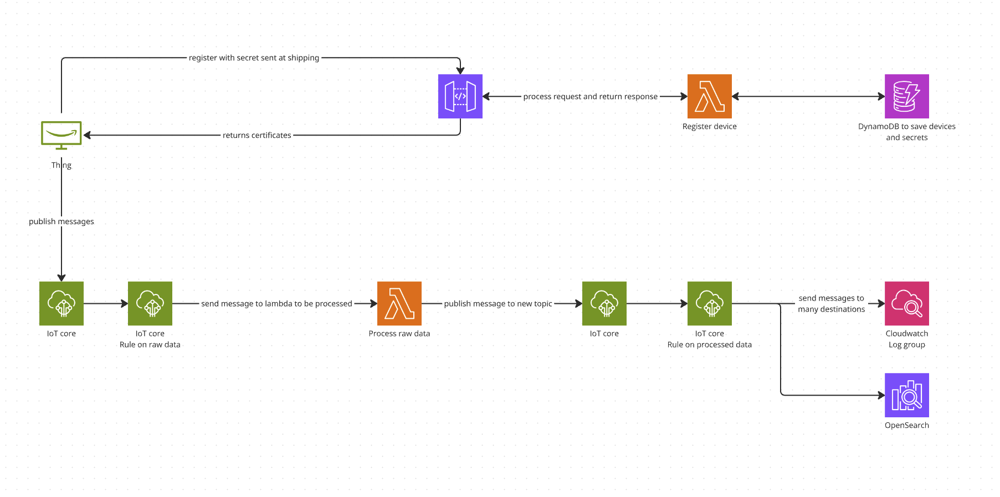

# aws-iot-poc

## Basic architecture



## Source code in python

### Installation

```
cd src
poetry install
```

### Running

#### Registering a new thing/device:

Arguments can be found in `src/register_device.py`

```
poetry run python3 register_device.py --device-id <device_id> --api-url https://<iot_core_end_point> --api-key <api_key_deployed_by_the_iac> --output-dir ./
```

Notes:
This script seed a new device with a new secret, but in the future we could have another process to seed a device with a secret.

---

#### Publishing message to AWS IoT Core:

Arguments can be found in `src/publish-iot-message.py`

```
poetry run python3 publish-iot-message.py --config ./<folder_created_for_thing_by_registering_a_new_device>.thing.config.json --topic temperatures
```

## CDK (Infra as Code)

### Installation

```
cd cdk
yarn
```

### Deploying

You will need to install [aws-vault](https://github.com/99designs/aws-vault) to manage your AWS credentials securely.

Also change the profile and env_name in `cdk/package.json` in which you want to deploy the infrastructure for command `diff` `deploy`

Sample: `aws-vault exec <profile_needed> -- cdk deploy '*' -c envName=<env_name>`

```
yarn diff
yarn deploy
```
